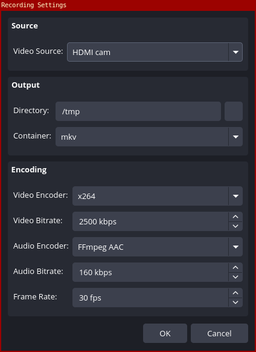

# OBS Multi Source Recorder

An OBS Studio plugin that records individual video sources to separate files, independent of the main program recording. Audio is captured from the OBS main audio mix.

Works on Linux, Windows, and macOS.

<p align="center">
  
</p>

## Features

- **Multiple source recordings** - record any number of video sources simultaneously to separate files
- **Independent from program recording** - source recordings run alongside (or without) the standard OBS recording
- **Per-entry configuration** - each recording has its own video/audio codec, bitrate, container format, and output directory
- **Native source resolution** - sources are recorded at their native resolution without scaling
- **Dock panel UI** - compact table-based interface docked in OBS with a settings dialog per entry
- **Auto-detection** - enumerates available video sources and encoders (x264, VAAPI, NVENC, etc.) at runtime
- **Config persistence** - recording entries are saved and restored with the OBS profile
- **Cross-platform** - builds and runs on Linux, Windows, and macOS

## How It Works

Each recording entry creates an independent pipeline using OBS views:

```
Video Source -> obs_view -> OBS render loop -> video encoder -+
                                                              +-> ffmpeg_muxer -> file
OBS main audio mix -----------------------> audio encoder ----+
```

The `obs_view` approach renders the source natively through OBS's internal render loop with no manual GPU readback. Audio is captured from the OBS main audio mix (all active audio sources).

## Building

### Prerequisites

- OBS Studio 28+ development headers/libraries
- CMake 3.28+
- Qt5 or Qt6 (Widgets module)
- A C17/C++17 compiler

### Linux

#### Arch Linux / Manjaro

```bash
sudo pacman -S obs-studio qt6-base cmake base-devel

git clone https://github.com/pugliatechs/obs-multirecord.git
cd obs-multirecord
make
sudo make install
```

#### Ubuntu / Debian

```bash
sudo apt install obs-studio libobs-dev qtbase5-dev cmake build-essential

git clone https://github.com/pugliatechs/obs-multirecord.git
cd obs-multirecord
cmake -B build -DCMAKE_BUILD_TYPE=Release
cmake --build build --parallel
sudo cmake --install build --prefix /usr
```

#### Fedora

```bash
sudo dnf install obs-studio obs-studio-devel qt6-qtbase-devel cmake gcc-c++

git clone https://github.com/pugliatechs/obs-multirecord.git
cd obs-multirecord
cmake -B build -DCMAKE_BUILD_TYPE=Release
cmake --build build --parallel
sudo cmake --install build --prefix /usr
```

#### Flatpak OBS

If you use the Flatpak version of OBS, copy the built plugin manually:

```bash
mkdir -p ~/.var/app/com.obsproject.Studio/config/obs-studio/plugins/obs-multi-record/bin/64bit/
cp build/obs-multi-record.so ~/.var/app/com.obsproject.Studio/config/obs-studio/plugins/obs-multi-record/bin/64bit/
cp -r data ~/.var/app/com.obsproject.Studio/config/obs-studio/plugins/obs-multi-record/
```

### Windows

#### Prerequisites

1. Install [Visual Studio 2022](https://visualstudio.microsoft.com/) (Community edition, with "Desktop development with C++" workload)
2. Install [CMake](https://cmake.org/download/) (3.28+)
3. Install [Git](https://git-scm.com/download/win)
4. Download the OBS Studio source or pre-built dependencies from the [OBS releases page](https://github.com/obsproject/obs-studio/releases)
5. Install Qt6 via the [Qt Online Installer](https://www.qt.io/download-qt-installer) or [aqtinstall](https://github.com/miurahr/aqtinstall)

#### Build

Open a **Developer Command Prompt for VS 2022** and run:

```cmd
git clone https://github.com/pugliatechs/obs-multirecord.git
cd obs-multirecord

cmake -B build ^
  -DCMAKE_BUILD_TYPE=Release ^
  -DCMAKE_PREFIX_PATH="C:\obs-studio;C:\Qt\6.x.x\msvc2022_64"

cmake --build build --config Release --parallel
```

#### Install

Copy the built files into your OBS plugin directory:

```cmd
copy build\Release\obs-multi-record.dll "%ProgramFiles%\obs-studio\obs-plugins\64bit\"
xcopy /E /I data "%ProgramFiles%\obs-studio\data\obs-plugins\obs-multi-record\"
```

Or install to the per-user plugin directory (no admin required):

```cmd
copy build\Release\obs-multi-record.dll "%APPDATA%\obs-studio\plugins\obs-multi-record\bin\64bit\"
xcopy /E /I data "%APPDATA%\obs-studio\plugins\obs-multi-record\data\"
```

### macOS

#### Prerequisites

1. Install [Homebrew](https://brew.sh/)
2. Install dependencies:

```bash
brew install obs cmake qt@6
```

#### Build

```bash
git clone https://github.com/pugliatechs/obs-multirecord.git
cd obs-multirecord

cmake -B build \
  -DCMAKE_BUILD_TYPE=Release \
  -DCMAKE_PREFIX_PATH="$(brew --prefix qt@6);$(brew --prefix obs-studio)"

cmake --build build --parallel
```

#### Install

Copy the built plugin into the OBS plugin directory:

```bash
mkdir -p ~/Library/Application\ Support/obs-studio/plugins/obs-multi-record/bin/
cp build/obs-multi-record.so ~/Library/Application\ Support/obs-studio/plugins/obs-multi-record/bin/
cp -r data ~/Library/Application\ Support/obs-studio/plugins/obs-multi-record/
```

## Usage

1. Open OBS Studio
2. Go to **View > Docks > Multi Recorder**
3. Click **Add** to create a new recording entry
4. Select a **Video Source** from the dropdown (only video-capable sources are listed)
5. Set the **Output Directory** (click `...` to browse)
6. Choose container format (MKV recommended), video/audio encoders, and bitrates
7. Click the play button on individual rows, or **Rec All**
8. Click the stop button when done. Files are written to the configured directory

Double-click any row to edit its settings.

### Audio

Audio is captured from the OBS main audio mix. All active audio sources (Desktop Audio, Mic, etc.) are included in the recording, matching what the standard OBS recording captures.

### Filename Format

Files are named using the pattern: `{SourceName}_{YYYYMMDD}_{HHMMSS}.{ext}`

Spaces and special characters in source names are replaced with underscores.

## Architecture

| File | Purpose |
|------|---------|
| `src/plugin-main.c` | Module entry point (`obs_module_load`) |
| `src/record-pipeline.h/c` | Per-source recording pipeline using `obs_view` |
| `src/multi-record-dock.hpp/cpp` | Qt dock panel UI, settings dialog, and config persistence |
| `src/source-combo-delegate.hpp/cpp` | Combo box delegate utility |
| `data/locale/en-US.ini` | Localisation strings |

## Disclaimer

THIS SOFTWARE IS PROVIDED "AS IS", WITHOUT WARRANTY OF ANY KIND, EXPRESS OR IMPLIED, INCLUDING BUT NOT LIMITED TO THE WARRANTIES OF MERCHANTABILITY, FITNESS FOR A PARTICULAR PURPOSE AND NONINFRINGEMENT. IN NO EVENT SHALL THE AUTHORS, COPYRIGHT HOLDERS, MARCO PENNELLI, OR PUGLIATECHS APS BE LIABLE FOR ANY CLAIM, DAMAGES OR OTHER LIABILITY, WHETHER IN AN ACTION OF CONTRACT, TORT OR OTHERWISE, ARISING FROM, OUT OF OR IN CONNECTION WITH THE SOFTWARE OR THE USE OR OTHER DEALINGS IN THE SOFTWARE.

Use this software at your own risk. The author and the organization assume no responsibility for any damages, data loss, security incidents, or other consequences resulting from the use or misuse of this software.

## Author

**Marco Pennelli** | [PugliaTechs APS](https://www.pugliatechs.com)

## License

GPLv2 - same as OBS Studio.
